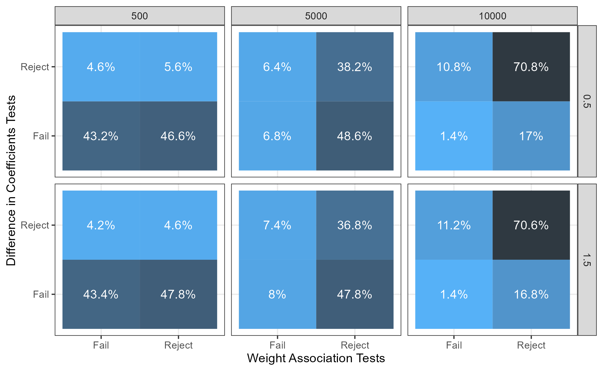

```{r, include = FALSE}
knitr::opts_chunk$set(
  collapse = TRUE,
  comment = "#>",
  fig.path = "man/figures/README-",
  out.width = "100%"
)
```

# weitest

<center>
  
</center>

The goal of `weitest` is to explore diagnostic tests of survey weights. Survey weights represent the number of population units that the observational unit $i$ represents. Let $\pi_{Si} = P(i \in S)$ be the selection probability of surveying observation $i$ from sample $S$. The adoption of survey weights into analysis is usually determined by field practices instead of diagnostic tests which might leave estimates significantly high levels of variance with little reduction in bias. Therefore, survey weight diagnostic tests are crucial to gaining a better understanding and grasp of how survey weights fit in statistical analysis and inference.

## Installation

You can install the development version of weitest from [GitHub](https://github.com/) with:

```{r, warning = FALSE, message = FALSE}
# install.packages("devtools")
devtools::install_github("harvard-stat108s23/project2-group21")
```

## Bias-Variance Tradeoff

A natural phenomena in statistics is the bias-variance tradeoff where if you gain a little bias to your estimators, you might be able to see a dramatic reduction in your variance, and vice versa. The package `weitest` imulates this by bootstrapping the RMSE estimates from weighted and unweighted linear regressions to find whether the difference of RMSE estimates are statistically significant. The `rmsewt_test` outputs a list of RMSE estimates, the $t$-statistic, and the corresponding $p$-value. With an Type I error rate of $\alpha = 0.05$, $p$-values less than 0.05 indicate that including weights in your linear regression significantly increase your RMSE such that the predictions are spread further away from the line of best fit.

```{r}
library(weitest)
data("LLCP2020")
rmsewt_test(y = "WEIGHT2", x = "HTIN4", covariates = c("RACE", "SEX"), weights = "LLCPWT",
            data = LLCP2020, boot_size = 500, iterations = 1000, alt_hypo = "two.sided")
```

On the other hand, survey weights offer a way to reduce biased estimators when sampling bias exists in the sample. Similar to `rmsewt_test`, `meanwt_test` aims to showcase statistically significant reductions in the bias of the mean estimator such that survey weights are adjusting the mean estimator towards the true mean of the target population. Below, we want to determine whether mean height (inches) is statistically different when it is weighted by population weights and when it is nonweighted.  Similarly, $p$-values less than 0.05 indicate that applying weights to height significantly alters to the mean such that weights are decreasing the bias. 

```{r}
meanwt_test(LLCP2020$HTIN4, LLCP2020$LLCPWT, boot_size = 500, iterations = 1000, alt_hypo = "two.sided")
```


## Model-Based Diagnostic Tests

There are two categories of survey weight diagnostic tests: weight association tests and difference in coefficients tests. Each used model-based inference using linear regression coefficients, but differ in their linear model setup. First, difference in coefficients tests compare weighted and unweighted regression coefficients on the exogenous variable to determine whether including weights led to a statistically different coefficient estimate between the two different linear models. The inferential test uses a $\chi_k^2$ with number of predictors $k$ degrees of freedom. 

```{r}
dc_test(y = "WEIGHT2", x = "HTIN4", w = "LLCPWT", data = LLCP2020)
```

Alternatively, we can use weight association tests which runs a single linear regression model but with a weighted and nonweighted predictor to determine whether the corresponding $p$-value is statistically significant. 

```{r}
wa_test(y = "WEIGHT2", x = "HTIN4", w = "LLCPWT", data = LLCP2020)
```

The strengths and weaknesses of difference of coefficients and weight association tests are still not known empirically as to how robust they are to heterogenity of standard errors and when their asymptotic properties "kick-in". Here is a preliminary simulation conducted as a prelude to my senior thesis escapade. 

<center>
  
</center>


